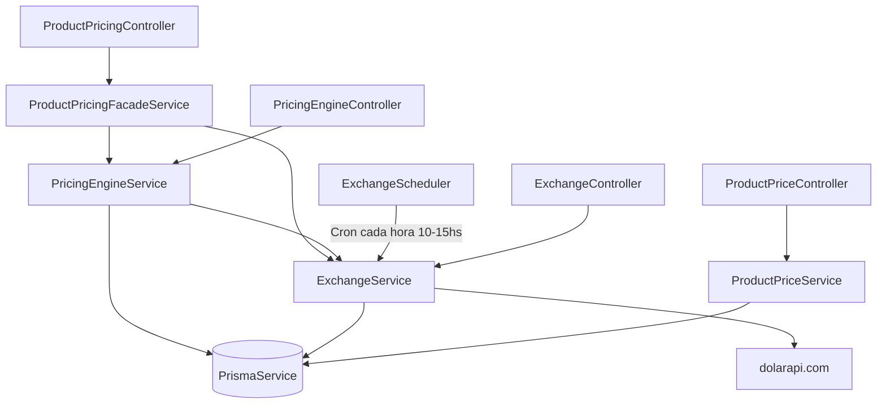

# Módulo ERP › Pricing

## Descripción general

El módulo `erp/pricing` gestiona toda la lógica de precios del sistema: desde el mantenimiento de precios base de productos hasta la resolución de precios con conversión de moneda, aplicación de impuestos y cálculo de documentos completos (carrito).

---

## Estructura de archivos

```
src/modules/erp/pricing/
├── pricing-engine.module.ts         # Módulo raíz del engine
├── pricing-engine.service.ts        # Motor de precios (core)
├── pricing-engine.controller.ts     # Endpoints del engine
│
├── exchange/                        # Sub-módulo de cotizaciones
│   ├── exchange.module.ts
│   ├── exchange.service.ts          # Sync, conversión y consulta de tasas
│   ├── exchange.controller.ts       # Endpoints de exchange
│   ├── exchange.scheduler.ts        # Cron de sincronización automática
│   ├── dto/
│   │   └── sync-exchange.dto.ts
│   └── interfaces/
│       └── dolar-api.interface.ts   # Shape de respuesta de dolarapi.com
│
└── product-pricing/                 # Sub-módulo de precios de producto
    ├── product-pricing.module.ts
    ├── product-pricing.service.ts   # CRUD de precios base
    ├── product-pricing-facade.service.ts  # Fachada pública
    ├── product-pricing.controller.ts      # Endpoints de pricing (facade)
    ├── product-price.controller.ts        # Endpoints CRUD de precios base
    ├── dto/
    │   ├── create-product-price.dto.ts
    │   └── update-product-price.dto.ts
    └── interfaces/
```

---

## Arquitectura



---

## Sub-módulo: `PricingEngine`

### Archivo
[pricing-engine.service.ts](file:///c:/proyectos/Asterisk_Suite/asterisksuite_backend/src/modules/erp/pricing/pricing-engine.service.ts)

### Responsabilidad
Es el **corazón del sistema de precios**. Se encarga de:
1. Resolver el precio de un producto con conversión de moneda.
2. Calcular un ítem completo con impuestos (base imponible, exenciones, total).

### Interfaces exportadas

```typescript
interface ResolvedItemTax {
  tax_id: string;
  tax_rate: number;
  tax_amount: number;
  calculation_level: string;   // 'line' | ...
  is_included_in_price: boolean;
}

interface ResolvedItem {
  product_id: string;
  quantity: number;
  currency: string;
  original_currency: string;
  original_unit_price: number;
  unit_price: number;
  converted_unit_price: number;
  exchange_rate: number;
  price: number;               // unit_price * quantity
  exempt_amount: number;       // price * (exemption_rate / 100)
  taxable_base: number;        // price - exempt_amount
  taxes: ResolvedItemTax[];
  total_taxes: number;
  total: number;               // taxable_base + total_taxes
}
```

### Métodos

#### `resolveProductPrice(productId, targetCurrencyCode)`
Resuelve el precio de un producto hacia la moneda destino.

- Busca el último `product_price` activo del producto.
- Si la moneda de origen difiere de la destino, llama a `ExchangeService.convertAmount()`.
- Devuelve precio original, precio convertido, tasa de cambio y tasa de exención.

**Retorna:**
```typescript
{
  product_id: string;
  currency: string;
  original_currency: string;
  original_price: number;      // redondeado a 2 decimales
  exchange_rate: number;       // redondeado a 6 decimales
  converted_price: number;     // redondeado a 2 decimales
  exemption_rate: number;
}
```

**Errores:**
| Condición | Excepción |
|---|---|
| Producto no existe | `NotFoundException` |
| Producto sin `price_enabled` | `BadRequestException` |
| Sin precios configurados | `NotFoundException` |

---

#### `resolveItemWithTaxes(productId, quantity, targetCurrencyCode, overrideUnitPrice?)`
Calcula el precio completo de una línea de documento/venta.

**Lógica:**
1. Si **no** se pasa `overrideUnitPrice`:
   - Llama a `resolveProductPrice` para obtener el precio desde BD.
   - No aplica a productos `is_rate_type` (requieren precio manual).
2. Calcula: `price = unit_price × quantity`
3. Calcula: `exempt_amount = price × (exemption_rate / 100)`
4. Calcula: `taxable_base = price - exempt_amount`
5. Para cada impuesto activo del producto (`product_taxes`):
   - Si `calculation_level === 'line'` y **no** está incluido en precio: `tax_amount = taxable_base × (tax_rate / 100)`
6. Suma todos los impuestos: `total_taxes`
7. `total = taxable_base + total_taxes`

> [!NOTE]
> Impuestos con `is_included_in_price = true` se muestran informativamente pero **no** se suman al total.

---

### Endpoints — `PricingEngineController`

Base: `/pricing-engine`

| Método | Ruta | Query Params | Descripción |
|---|---|---|---|
| `GET` | `/pricing-engine/product/:productId` | `currency` | Resuelve el precio base de un producto en la moneda indicada |
| `GET` | `/pricing-engine/product/:productId/item` | `quantity`, `currency`, `override_price?` | Calcula un ítem completo con impuestos |

---

## Sub-módulo: `Exchange`

### Archivo
[exchange.service.ts](file:///c:/proyectos/Asterisk_Suite/asterisksuite_backend/src/modules/erp/pricing/exchange/exchange.service.ts)

### Responsabilidad
Gestiona las cotizaciones de moneda extranjera. Se integra con la API pública **[dolarapi.com](https://dolarapi.com)** para obtener y persistir cotizaciones en la tabla `currency_rates`.

### Tipos de cotización soportados (`CurrencyRateType`)

| Enum | Casa (API) | Descripción |
|---|---|---|
| `OFFICIAL` | `oficial` | Dólar oficial |
| `BLUE` | `blue` | Dólar blue |
| `MEP` | `bolsa` | Dólar MEP/Bolsa |
| `CCL` | `contadoconliqui` | Dólar CCL |
| `WHOLESALE` | `mayorista` | Dólar mayorista |
| `CRYPTO` | `cripto` | Dólar crypto |
| `CARD` | `tarjeta` | Dólar tarjeta |

### Métodos

#### `syncAllRates()`
Ejecuta `syncOfficialRates` y `syncDollarRates` en una única transacción de BD.

#### `syncOfficialRates(tx?)`
Sincroniza desde `https://dolarapi.com/v1/cotizaciones`.
- Crea monedas si no existen.
- Solo inserta si la cotización cambió (evita duplicados).

#### `syncDollarRates(tx?)`
Sincroniza desde `https://dolarapi.com/v1/dolares`.
- Solo procesa las casas que **no** son `oficial` (ya cubiertas por `syncOfficialRates`).

#### `convertAmount(amount, fromCode, toCode, rateType?)`
Convierte un monto entre dos monedas.

**Lógica de búsqueda de tasa:**
1. Si `from === to` → devuelve el mismo monto con `rate: 1`.
2. Busca tasa directa `from → to` en `currency_rates`.
3. Si no existe, busca tasa inversa `to → from` y calcula `1 / rate`.
4. Si tampoco existe → `NotFoundException`.

**Retorna:**
```typescript
{
  amount: number;
  from: string;
  to: string;
  rate_type: CurrencyRateType;
  rate: number;               // 6 decimales
  converted_amount: number;   // 6 decimales
  inverse?: boolean;
  effective_date?: Date;
}
```

#### `getLatestRate(fromCode, toCode, rateType?)`
Devuelve la última cotización directa registrada entre dos monedas, incluyendo las entidades `from_currency` y `to_currency`.

---

### Scheduler — `ExchangeScheduler`

**Cron:** `0 10-15 * * 1-5`  
**Timezone:** `America/Argentina/Buenos_Aires`

Ejecuta `syncAllRates()` automáticamente cada hora entre las **10:00 y las 15:00, de lunes a viernes**.

---

### Endpoints — `ExchangeController`

Base: `/exchange`

| Método | Ruta | Params | Descripción |
|---|---|---|---|
| `POST` | `/exchange/sync/official` | — | Sincroniza cotizaciones oficiales manualmente |
| `POST` | `/exchange/sync/dollars` | — | Sincroniza cotizaciones dólar manualmente |
| `GET` | `/exchange/convert` | `amount`, `from`, `to`, `rateType?` | Convierte un monto entre monedas |
| `GET` | `/exchange/rate/:from/:to` | `rateType?` | Obtiene la última tasa de cambio |

---

### Interface externa

```typescript
// dolar-api.interface.ts
interface DolarApiQuote {
  moneda: string;
  casa: string;
  nombre: string;
  compra: number;
  venta: number;
  fechaActualizacion: string;
  variacion?: number;
}
```

> [!NOTE]
> El servicio usa el valor `venta` (precio de venta) como tasa de referencia.

---

## Sub-módulo: `ProductPricing`

### Responsabilidad
Gestiona el **CRUD de precios base** asignados a productos (`product_price` en BD) y expone una **fachada pública** de alto nivel para que otras partes del sistema consulten precios sin conocer los detalles internos.

---

### `ProductPriceService` (CRUD)

[product-pricing.service.ts](file:///c:/proyectos/Asterisk_Suite/asterisksuite_backend/src/modules/erp/pricing/product-pricing/product-pricing.service.ts)

| Método | Descripción |
|---|---|
| `create(dto, createdBy?)` | Crea un precio base. Valida que el producto y moneda existan y que no haya un precio activo duplicado para esa combinación. |
| `findByProduct(productId)` | Lista todos los precios activos de un producto. |
| `findOne(id)` | Obtiene un precio por ID (soft-delete aware). |
| `update(id, dto, updatedBy?)` | Actualiza `price` y/o `exemption_rate`. |
| `remove(id, deletedBy?)` | Soft-delete del precio. |

#### DTO: `CreateProductPriceDto`
```typescript
{
  product_id: string;      // UUID — requerido
  currency_id: string;     // UUID — requerido
  price: number;           // >= 0 — requerido
  exemption_rate?: number; // >= 0 — opcional (default 0)
}
```

#### DTO: `UpdateProductPriceDto`
Extiende `CreateProductPriceDto` con todos los campos opcionales via `PartialType`.

---

### Endpoints — `ProductPriceController` (🔒 JWT requerido)

Base: `/product-prices`

| Método | Ruta | Body / Params | Descripción |
|---|---|---|---|
| `POST` | `/product-prices` | `CreateProductPriceDto` | Crea un precio base para un producto |
| `GET` | `/product-prices/product/:productId` | — | Lista precios de un producto |
| `GET` | `/product-prices/:id` | — | Obtiene un precio por ID |
| `PATCH` | `/product-prices/:id` | `UpdateProductPriceDto` | Actualiza un precio |
| `DELETE` | `/product-prices/:id` | — | Elimina un precio (soft-delete) |

---

### `ProductPricingFacadeService` (Fachada pública)

[product-pricing-facade.service.ts](file:///c:/proyectos/Asterisk_Suite/asterisksuite_backend/src/modules/erp/pricing/product-pricing/product-pricing-facade.service.ts)

Orquesta `PricingEngineService` y `ExchangeService`. Es el punto de entrada recomendado para otros módulos que necesiten precios.

| Método | Descripción |
|---|---|
| `getUnitPrice(productId, currency)` | Precio unitario convertido (sin impuestos). Retorna `null` si el producto no tiene `price_enabled` ni `is_rate_type`. |
| `getSellPrice(productId, qty, currency, overrideUnitPrice?)` | Precio completo con impuestos para una línea de venta. Delega a `PricingEngineService.resolveItemWithTaxes`. |
| `calculateCart(items, currency)` | Calcula un carrito/documento completo. Retorna ítems resueltos + subtotal + total_taxes + total. |
| `convert(amount, from, to)` | Conversión de moneda simple (delegada a `ExchangeService`). |

---

### Endpoints — `ProductPricingController`

Base: `/pricing`

| Método | Ruta | Query Params | Descripción |
|---|---|---|---|
| `GET` | `/pricing/unit/:productId` | `currency` | Precio unitario convertido (sin impuestos) |
| `GET` | `/pricing/sell/:productId` | `qty`, `currency`, `unitPrice?` | Precio de venta completo con impuestos |
| `POST` | `/pricing/cart` | Body: `{ currency, items: [{productId, quantity}] }` | Cálculo de carrito/documento |
| `GET` | `/pricing/convert` | `amount`, `from`, `to` | Conversión de moneda simple |

---

## Flujo completo: Resolución de precio de venta

```
POST /pricing/cart  { currency: "ARS", items: [{productId: "abc", quantity: 2}] }
  └→ ProductPricingFacadeService.calculateCart()
       └→ PricingEngineService.resolveItemWithTaxes("abc", 2, "ARS")
            ├→ [si no override] resolveProductPrice("abc", "ARS")
            │    ├→ prisma.product_price.findFirst()          ← precio base en BD
            │    └→ ExchangeService.convertAmount()           ← conversión si aplica
            ├→ Calcula price = unit_price × quantity
            ├→ Calcula exempt_amount = price × exemption_rate%
            ├→ Calcula taxable_base = price - exempt_amount
            └→ Para cada tax activo del producto:
                 └→ tax_amount = taxable_base × tax_rate%  (si es 'line' y no incluido)
```

---

## Dependencias externas

| Servicio | URL | Uso |
|---|---|---|
| dolarapi.com | `https://dolarapi.com/v1/cotizaciones` | Cotizaciones oficiales de todas las monedas |
| dolarapi.com | `https://dolarapi.com/v1/dolares` | Tipos de dólar (blue, MEP, CCL, etc.) |

> [!WARNING]
> Las solicitudes a dolarapi.com tienen un **timeout de 5 segundos**. Si se supera, se lanza `BadRequestException` con mensaje `"Timeout consultando [url]"`.

---

## Tablas de BD involucradas

| Tabla | Uso |
|---|---|
| `products` | Verifica existencia, `price_enabled`, `is_rate_type` |
| `product_price` | Precios base por producto/moneda (soft-delete con `deleted_at`) |
| `product_taxes` | Impuestos activos asociados a cada producto |
| `taxes` | Detalle de impuesto: `rate`, `calculation_level` |
| `currencies` | Catálogo de monedas |
| `currency_rates` | Historial de cotizaciones sincronizadas |

---

## Utilidades internas

```typescript
round2(value: number): number  // Math.round(value * 100) / 100
round6(value: number): number  // Math.round(value * 1_000_000) / 1_000_000
```

Usadas internamente para evitar errores de punto flotante en los cálculos monetarios.
